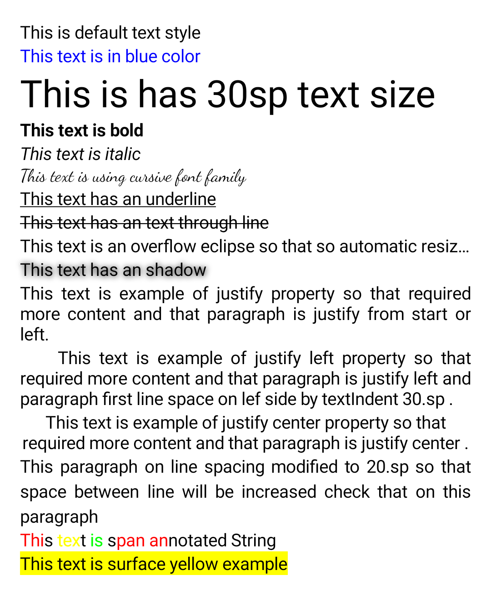
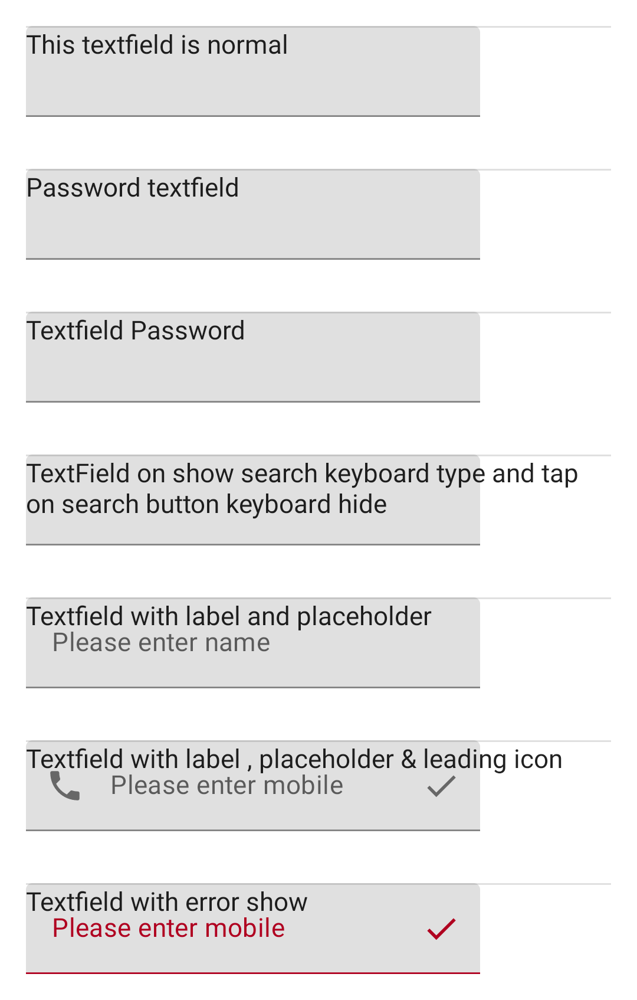

# Jetpack Compose Examples

This repository contains Jetpack Compose way of building common
Android UI that we are accustomed to building.

### General

### Text

|Example|Preview|
|-------|-------|
|[ Initial Project ](https://github.com/shindejayesharun/android_compose/blob/master/app/src/main/java/com/shindejayesharun/jetpack_compose/examples/SimpleTextActivity.kt)| |
|[ Text Samples ](https://github.com/shindejayesharun/android_compose/blob/master/app/src/main/java/com/shindejayesharun/jetpack_compose/examples/TextViewSampleActivity.kt)| |
|[ TextField Samples ](https://github.com/shindejayesharun/android_compose/blob/master/app/src/main/java/com/shindejayesharun/jetpack_compose/examples/EditTextSampleActivity.kt)| |

License
-----------------

    Copyright 2020 Jayesh Shinde

    Licensed under the Apache License, Version 2.0 (the "License");
    you may not use this file except in compliance with the License.
    You may obtain a copy of the License at

       http://www.apache.org/licenses/LICENSE-2.0

    Unless required by applicable law or agreed to in writing, software
    distributed under the License is distributed on an "AS IS" BASIS,
    WITHOUT WARRANTIES OR CONDITIONS OF ANY KIND, either express or implied.
    See the License for the specific language governing permissions and
    limitations under the License.
